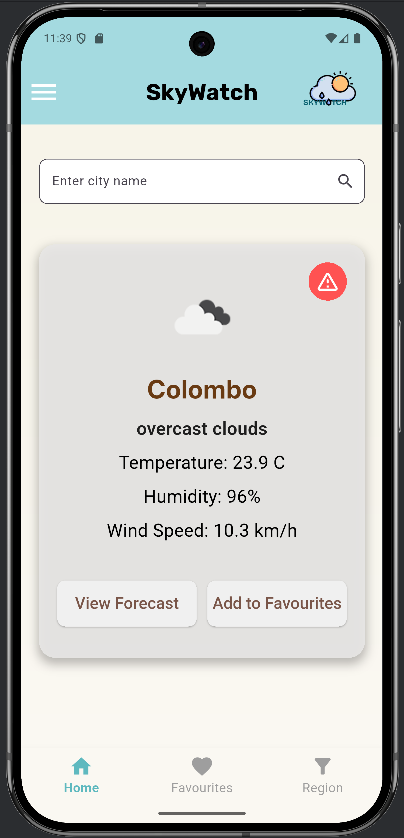
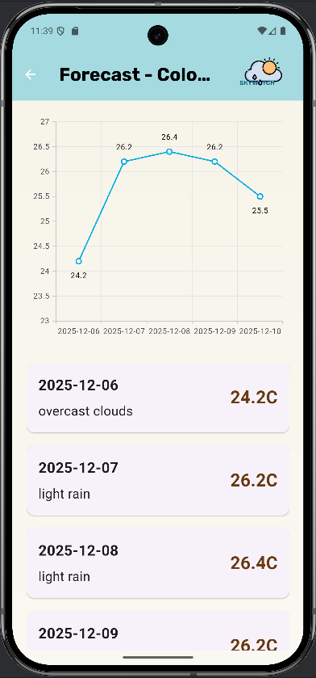
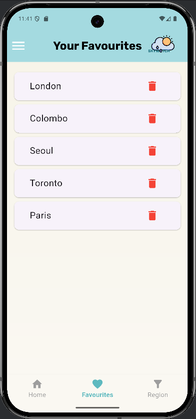
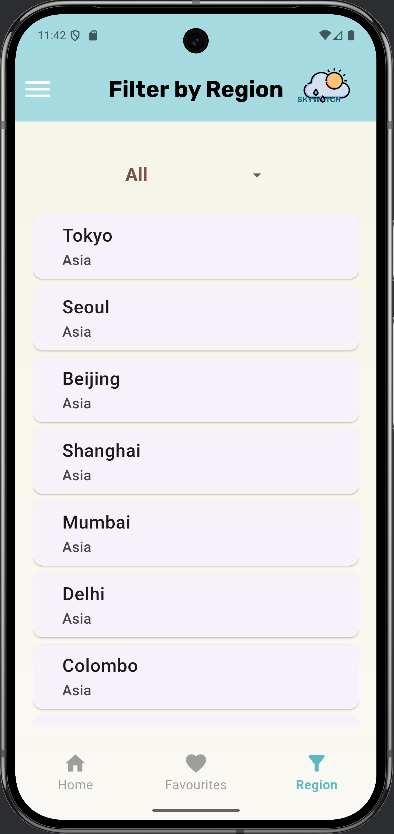
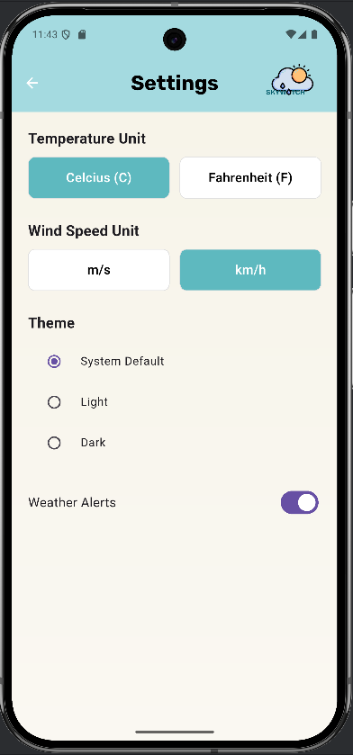

# SkyWatch

SkyWatch is a flutter-based mobile application developed for tracking weather forecast details of different locations including temperature, humidity and the wind speed.

## features

- Home screen with weather forecast summery
- Search for weather forecasts by entering city name
- View detailed forecasts with graph views and 5-day forecasts
- Adding cities to the favourites list
- View a list of all the favourites list
- Delete favourite cities
- Filter cities by region
- Receive weather alerts for different cities
- Change app design using settings

## how the app works

- The users are able search for cities and view their weather forecasts
- Home screen will show a summery of weather details of the searched city
- Forecast screen will display a detailed forecast of a selected city, including a graph to show 5-day forecast details
- Users can add cities to their favourites list and remove them if needed
- The filter by region screen will allow users to select a region from the dropdown menu and view the major cities located in a specific region
- Users will be able to see the weather details by clicking a city in the favourite screen or the region filter screen
- Users can change the app theme, change the displaying units of temperature and wind speed, and turn on or off weather alerts for cities by using the settings screen

## technologies used
- Flutter as the main framework
- Android Studio as the code editor and to run the app
- Dart as the programming language
- Git and GitHub as the version control
- SQlite as the database management system
- Provider as StateManagement

## User Interfaces
- )
- 
- 
- 
- 

